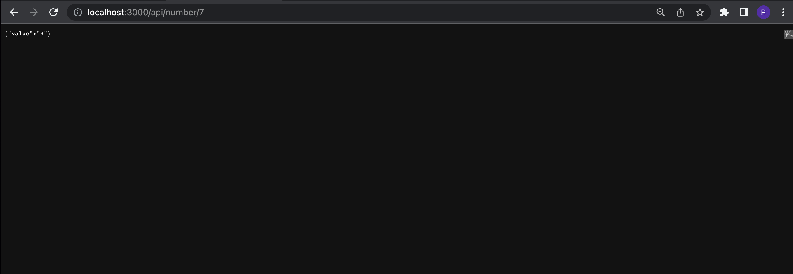
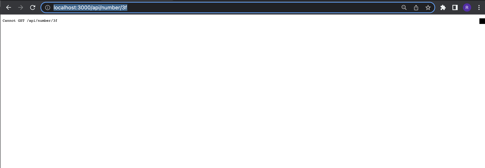

#NodeJS backemd app

## Screenshot

## Built With
- Major Languages: JAVASCRIPT, NodeJs
- Major Technologies : Git, Github

### Prerequisites
- node installed
- npm ( Node Package Manager )
- git and Github Account
- nodemon

### Run project
- Now run the following:
 `npm install`  - on the root directory of the project to install the required packages
 `nodemon`   - on the root directory of the project to start the project 
- check on your configured localhost

## Authors

👤 **Richard Opiyo**

- GitHub: [@richardoppiyo](https://github.com/richardoppiyo)
- Twitter: [@blessed_ricky](https://twitter.com/blessed_ricky)
- LinkedIn: [Richard Opiyo](https://linkedin.com/in/richardoppiyo)

## Show your support

Give a ⭐️ if you like this project!

## Acknowledgments

- Badili.africa team

## 📝 License

This project is [MIT](./MIT.md) licensed.
